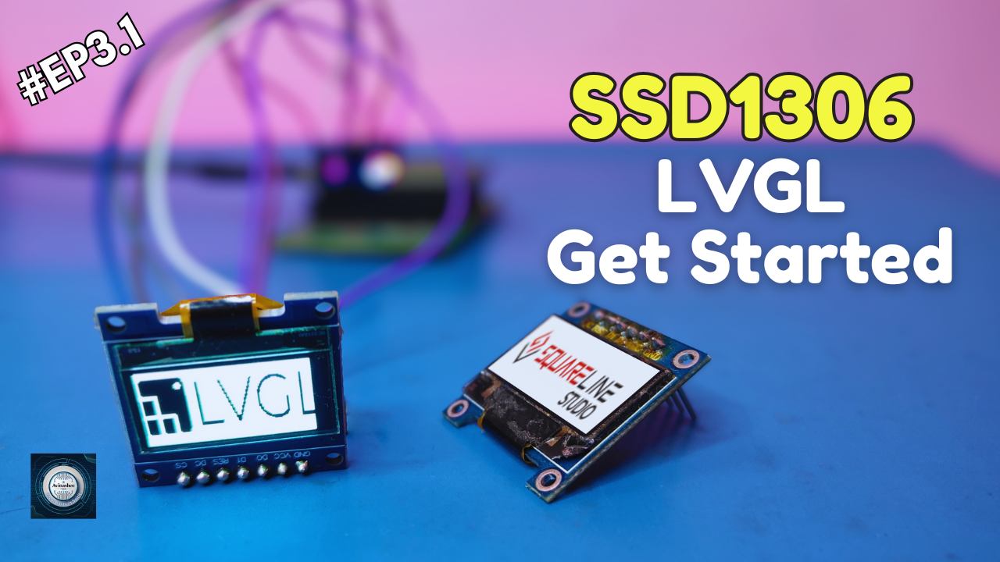

<h1 align="center">
  <a href="https://www.youtube.com/@eccentric_engineer">
	
  </a>  
</h1>

<h3 align="center">
	LVGL UI on STM32
</h3>


  
## 📝 Overview

This release captures the milestone where we successfully integrated UI using SquareLine Studio and LVGL v8.4.0 with the STM32 (STM32CubeIDE) environment to display a clock like UI on the SSD1306 OLED. The implementation focuses on delivering a clean, modular, and reusable codebase of LVGL for different controllers. Our approach throughout the display series was to make reusable code.

We Implemented FreeRTOS guiTask to handle LVGL and UI initialization, buffers, and drivers. Later we updated UI panels clock value in realtime.

This project represents the third stage of the SSD1306 + STM32 integration: building a UI setup and displaying Time, Day and Date like a Clock similar to our ESP32 approach and can be easily replicated to other controllers as well. To understand basics of LVGL, SquareLine Studio, code structure, do refer to our videos on YouTube.

Reference taken from Adafruit SSD1306 library - https://github.com/adafruit/Adafruit_SSD1306  
Platform used for firmware development is STM32CubeIDE v1.18.1, LVGL 8.4.0 and SquareLine Stuido 1.15.2.  
Learn more about this series 👇👇  
  
Part 1 👇  
[](https://youtu.be/BN-J8Ks-_c4)  

Part 2.1 👇  
[](https://youtu.be/xIpSNDCL8Ik)  

Part 2.3 👇  
[](https://youtu.be/BlbK9RoPh0g)  

Part 3.1 👇  
[](https://youtu.be/Ke5_fm0Cos)  

Part 4.2 👇  
[](https://youtu.be/PwL7o8OogUw)
  
## ✔️ Requirements

### 📦 Hardware
- STM32F411 Black Pill (main controller  board)
- USB C Cable
- SSD1306 Oled Display Module
- Jumper Cables 

### 📂 Software
- STM32CubeIDE (https://www.st.com/en/development-tools/stm32cubeide.html)  
- LVGL 8.4.0 (https://github.com/lvgl/lvgl/releases/tag/v8.4.0)
- SquareLine Studio (https://squareline.io/downloads)


## 🛠️ Installation and usage

```sh
git clone https://github.com/AvinasheeTech/stm32-ssd1306-cubeide-driver.git
Open STM32CubeIDE.
Go to option 'Open Projects from File System' and select project directory.
Go to Core/Src/main.c and press Ctrl+B shortcut to build it or use build icon from toolbar.
Next connect ST-LinkV2 with your board. Setup Debug Configurations. 
Select Run or Debug icon and make sure that elf file is selected in respective configurations.
Once upload is complete, connect SSD1306 oled module to the spi pins highlighted in .ioc file.
Enjoy...🍹
```
To learn more about how to upload code to STM32 using STLink-V2, click link below 👇👇  

[](https://youtu.be/XuZgJvGf_Nw)


## ⭐️ Show Your Support

If you find this helpful or interesting, please consider giving us a star on GitHub. Your support helps promote the project and lets others know that it's worth checking out. 

Thank you for your support! 🌟

[](https://github.com/AvinasheeTech/stm32-ssd1306-cubeide-driver/stargazers)
